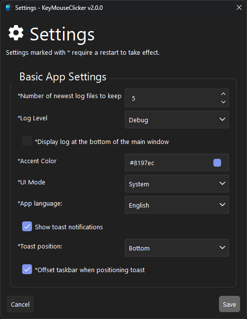

<picture>
  
</picture>

 

# 📄Description

This is a small mouse and keyboard autoclicker and holder.

**Only Windows is supported!**

# 🕹Features

- Autoclicker and hold mode
- Remembers settings
- Supports mouse and keyboard
- Shows a unobtrusive toast notification upon activation
  - Can be disabled

### Planned

- A checkbox for supressing the hotkey for other apps

# 🖼️Screenshots

 

### (Optional) Toast Notifications:

### Highly customizable

# 🫶Contributing

## Feedback (Suggestions/Issues)

If you encountered an issue/error or have a suggestion, open an issue with sufficient information.

## Code contributions

### 1. Install requirements

1. Install [Python 3.12](https://www.python.org/downloads/) (Make sure that you add it to PATH!)
2. Install [uv](https://github.com/astral-sh/uv#installation)
3. Clone repository
4. Open a terminal in the cloned repository folder
5. Run the following command to init your local environment and to install all dependencies
   `uv sync`

### 2. Execute from source

1. Open a terminal in the root folder of this repo
2. Execute main file with uv
   `uv run src\main.py`

### 3. Compile and build executable

1. Run `build.bat` from the root folder of this repo.
2. The executable and all dependencies are built in the `dist/KeyMouseClicker`-Folder and get packed in a `dist/KeyMouseClicker v[version].zip`.

### 4. Optional: Build Inno Setup installer

1. Install [Inno Setup](https://jrsoftware.org/download.php/is.exe) and add its installation folder to PATH
2. Run the `build_iss.bat` from the root folder of this repo.
3. The installer executable gets outputted in `dist/KeyMouseClicker_v[version]_installer.exe`.

## Translations

Make sure to follow the steps under [Code contributions](#code-contributions) above to install all requirements, including the Qt tools to translate this app.

1. To generate a translation file for a new language, copy the following line in [update_lupdate_file.bat](./update_lupdate_file.bat#L7):
   `--add-translation=res/loc/de.ts ^`, insert it directly beneath it and change the `de` value to the short code of your language.
   For example, to generate a file for French, the new line would look like this: `--add-translation=res/loc/fr.ts ^`
2. Run `update_lupdate_file.bat && update_qts.bat` to generate the translation file for your language.
3. Open the translation file in Qt Linguist with `uv run pyside6-linguist res/loc/<language>.ts`, eg. `uv run pyside6-linguist res/loc/fr.ts`.
4. Translate the app and save the file with Ctrl+S.
5. For the compiled language file to be bundled with the app, you have to add the compiled file under `<!-- Localisation -->` in [resources.qrc](./res/resources.qrc#L48). For example, for French: `<file>loc/fr.qm</file>`.
6. For your language to show up in FCK's settings: add a line, similar to the existing languages, under `class AppLanguage(BaseEnum):` in [app_config.py](./src/core/config/app_config.py#L19). For example, for French: `French = "fr_FR"`.
7. Optional: Run `compile_qts.bat && uv run src\main.py` and change the language in *Settings* to your translation (and restart) to see your translation in action.
8. Create a pull request from your changes and I will check over it and merge it if there are no issues with it.

# 🔗Credits

- Code by [Cutleast](https://github.com/Cutleast)
- Idea is based on this [project](https://sourceforge.net/projects/keyboard-clicker-holder/)
- Qt by The [Qt Company Ltd](https://qt.io)
- App Icon from [icons8.com](https://icons8.com)

See [licenses.py](./src/licenses.py) for a complete list of used software.
